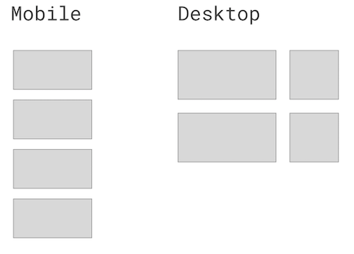

## The Layout

Layout is front-end developer's bread and butter and luckily our tooling is becoming better and better. Almost gone are the days when we had to use tables or floats to align things.  
Today I'd like to implement a simple responsive grid using css grid spec but also provide a reliable fallback for our legacy browser users.



## Mobile-first approach

I start mobile first and make all the cells appear in a stack.  
This is how you go about implementing it in the modern css grid spec.

```html
<div class="panel">
  <div>One</div>
  <div>Two</div>
  <div>Three</div>
  <div>Four</div>
</div>
```

```css
:root {
  --grid-gap: 1.5rem;
}

.panel {
  display: grid;
  grid-template-columns: 1fr;
  grid-gap: var(--grid-gap);
}
```

If you've never seen css custom properties before you might be suprised by `:root` syntax but it's just a way to declare a global variable. We will be able to reuse it throughout the app.

## Responsive behaviour for CSS grid

Next we want to add responsive behaviour to display two column layout where the first column is 2/3 and the second is 1/3 of the width.  
If you are using preprocessor that supports nesting (e.g. SASS / LESS / postcss-nested) then you have a luxury to nesting a media query inside the `.panel`

```css
.panel {
  display: grid;
  grid-template-columns: minmax(320px, 2fr) minmax(320px, 1fr);
  grid-gap: var(--grid-gap);
  min-height: 0;
  min-width: 0;

  @media (min-width: 64em) {
    grid-template-columns: 2fr 1fr;
  }
}
```

In pure css you need to put media query on the top level. This is what preprocessors do for you anyway.

```css
@media (min-width: 64em) {
  .panel {
    grid-template-columns: 2fr 1fr;
  }
}
```

## Older browsers support

If you open up our code in IE11 or, say, Chrome from 2016, our beautiful grid will be torn in pieces.  
`@supports` is [a handy css at-rule](https://developer.mozilla.org/en-US/docs/Web/CSS/@supports) that allows us to query for supported features and provide our modern code only for supported browsers.

But that will still leave IE11 users unhappy. For them exclusively we will implement the same layout in a not-so-shiny-but-well-supported flexbox.

Here's the final solution with all the perks:

```css
:root {
  --grid-gap: 1.5rem;
}

.panel {
  /* Flexbox fallback for IE11 and older browsers supporting flexbox */
  display: flex;
  flex-wrap: wrap;
  justify-content: space-between;

  & > * {
    margin-bottom: var(--grid-gap);
  }

  & > :nth-child(odd) {
    flex-basis: calc(66.6% - var(--grid-gap) / 2);
  }

  & > :nth-child(even) {
    flex-basis: calc(33.3% - var(--grid-gap) / 2);
  }

  /* Deliver CSS grid only to the browsers that support it */
  @supports (display: grid) {
    display: grid;
    grid-template-columns: 1fr;
    grid-gap: var(--grid-gap);
    min-height: 0;
    min-width: 0;

    @media (min-width: 64em) {
      /* two columns for bigger screens */
      grid-template-columns: 2fr 1fr;
    }

    & > * {
      /* margin-bottom is not required anymore as grid-gap will take care of vertial gaps too */
      margin-bottom: 0;
    }
  }
}
```

## Further reading

If you want to improve your layout skills and get a deeper understanding into advanced techniques, this is [THE BOOK](https://abookapart.com/products/the-new-css-layout) by Rachel Andrew. Well written and geniously explained, cannot recommend it more!
