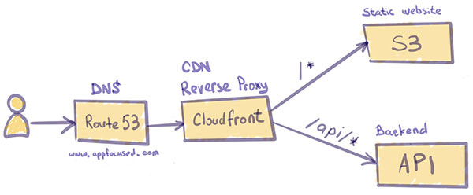
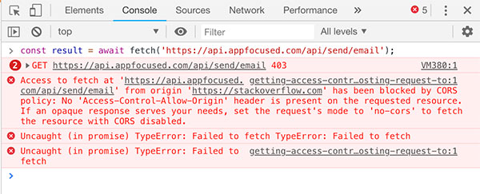
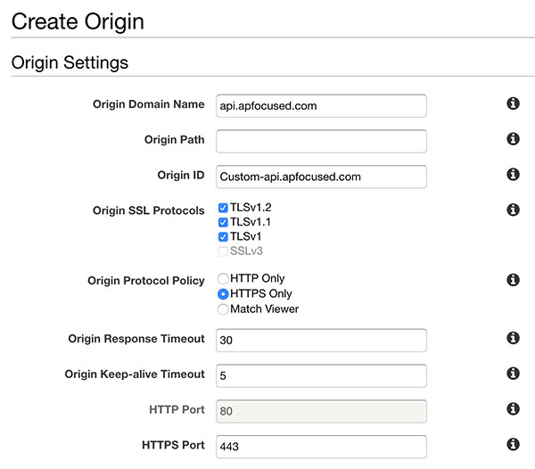
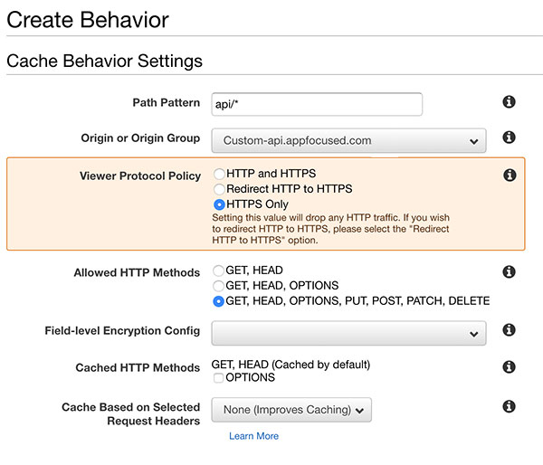

Recent advances in web apps architecture showed that decoupled frontend provides more flexibility for development and operations:

- Lets you work on one end without depending on the other
- Lets you build and <u>deploy separately</u>
- Makes it easy to use different tools on each end



<center><small>Decoupled frontend architecture</small></center>
<p></p>

## Problem

When an app is developed with this architecture in mind, frontend needs to communicate to backend via APIs, generally [REST](https://developer.mozilla.org/en-US/docs/Glossary/REST). It often occurs that the URL/port of the backend server differs from the frontend's one (given separate deployment paths). For example, the URL to the frontend app is `https://www.appfocused.com` and the REST endpoint to send contact emails is served from `https://api.appfocused.com`.

If we try to make an HTTP request from the frontend app to the backend server, it will fail as it violates [Same Origin Policy](https://developer.mozilla.org/en-US/docs/Web/Security/Same-origin_policy). In Chrome's console it will look like this:



Browsers, for security reasons, restrict requests which are not from the same origin. This prevents attackers from injecting code into our app and stealing our sensitive information. Browsers append [`origin`](https://developer.mozilla.org/en-US/docs/Web/HTTP/Headers/Origin) header on cross-origin requests to let the server know of a potential threat. The server then has the authority to either allow or reject these origins by providing specific response headers which are parsed by the browsers.

There are 2 solutions to fix this small problem:

- Hardcode absolute API URLs on the client and configure CORS headers on the server
- Use relative API URLs on the client and use a reverse-proxy approach

In this post, I will talk about why the former approach with CORS headers should be considered an antipattern for production-ready code and how to configure the reverse-proxy approach on various setups:

- local devserver
- web server / app server
- serverless (Cloudfront / S3 / Lambda)
  <p></p>

## Rationale

CORS headers scenario sounds like less pain to implement (and it is). However, there are a few concerns to consider that made me preach for the **reverse proxy approach** under almost any circumstances.

First and foremost, the backend might not be owned by you and it might be impossible to make the change to the CORS headers.

If you are lucky enough to control the backend and can configure CORS headers, for multiple web clients accessing the API server you will need to maintain a whitelist in order to give them access. Of course, wildcard is also an option, but it would be unreasonable to whitelist all the origins by setting `access-control-allow-origin` to `*` unless it is a public server.

Another common pattern, during development, is to run our UI application at `localhost:$port` , but whitelisting localhost to facilitate API calls is an anti-pattern and should be avoided for security reasons.

Last but not least, I like my build to conform to **Build Once, Deploy Many** principle.
It is one of the fundamental principles of Continuous Delivery. Binary (in our case static files for the web client) is built only once and subsequent deployments, testing and releases should never attempt to build the binary artifacts again, instead reusing the already built binary.

Practically that means that hardcoded absolute URLs like `https://api.appfocused.com/email/send` in our client code will stop us from having a single artifact, because on development environment I want my web client to hit, say, `https://api-dev.appfocused.com/email/send`.
"Never hardcode an absolute API URL in your client code" - became a powerful mantra for me and helped me to overcome some challenges on the way.

## Solution

Relative URL `/email/send` can solve it once and for all on the client, making "Build Once, Deploy Many" possible. It is proxy's work to orchestrate the request further. It also deals with the restrictions imposed by the browser. The proxy server, in this case, takes the onus of handling our requests, responses, and making the modifications necessary to facilitate cross-origin communication.

### Reverse proxy with webpack-devserver

When you are developing on your local machine you want the same treatment for your API as on other environments. Webpack can be configured to proxy requests.

```js
module.exports = {
  //...
  devServer: {
    proxy: {
      '/api': 'http://localhost:9000'
    }
  }
};
```

<center><small>webpack.config.js</small></center>
<p></p>

A request from client to relative path `/api/users` will now proxy the request to `http://localhost:9000/api/users`. Please check [webpack documentation](https://webpack.js.org/configuration/dev-server/#devserver-proxy) if you want to configure URL rewrite scenarios or add secure protocol.

Proxy can also be configured for projects built on Webpack like [create-react-app](https://facebook.github.io/create-react-app/docs/proxying-api-requests-in-development#docsNav) or [Gatsby](https://www.gatsbyjs.org/docs/api-proxy/).

### Reverse proxy with NGINX

NGINX is a common component in production environment architecture and has a number of advanced load balancing, security, and acceleration features that most specialized applications lack. Using NGINX as a reverse proxy enables you to add these features to any application.

The simplest reverse proxy config on NGINX will look like this

```
server {
  listen 80;
  listen [::]:80;

  server_name appfocused.com;

  location /api {
      proxy_pass http://api.appfocused.com/;
  }
}
```

<center><small>/etc/nginx/conf.d/app.conf</small></center>
<p></p>

The `proxy_pass` directive is what makes this configuration a reverse proxy. It specifies that all requests which match the location block (in this case `/api` path) should be forwarded to `http://api.appfocused.com`, where our backend is running.

Check the [full doc](https://docs.nginx.com/nginx/admin-guide/web-server/reverse-proxy/) for some more elaborate scenarios.

### Reverse proxy with serverless

We will look at AWS platform for serverless scenario. In one of my previous posts I explained how we use [serverless architecture to host our website](https://www.appfocused.com/blog/static-site-with-aws-cloud-front-gatsby/). AWS Cloudfront is playing one of the key roles in it acting as CDN and providing security at the edge for our static files stored on S3.

The first API that we had to integrate into this setup was a contact form. The brief for implementation was the following:

> When cliend posts to `https://www.appfocused.com/api/send/email`, under the covers request needs to be routed to `https://api.appfocused.com/api/send/email` where our backend API is deployed in the form of Lambda function.

It turns out that CloudFront supports multiple origin servers, and uses path patterns to determine which origin server to forward requests to. Multiple independent servers, even systems that aren't inside AWS, can all "own" one or more paths under a single hostname, with one of them being the default and owning all the paths not explicitly configured.

The concept is very similar to reverse proxies in Nginx or Apache, but the request routing is done by CloudFront, which connects to the appropriate back-end, sends the request, and returns (and possibly caches) the response. It does not redirect the request, so the URL address never changes for the consumer.

### Cloudfront configuration

Configure a new CloudFront distribution. Use the main site's hostname (e.g. `www.appfocused.com`) as the origin. Configure the site's domain name as an alternate domain name in CloudFront.

Next, add a second origin, with the destination being the hostname where the WP deployment can be reached. Create a behavior with a [path pattern](http://docs.aws.amazon.com/AmazonCloudFront/latest/DeveloperGuide/distribution-web-values-specify.html#DownloadDistValuesPathPattern) that matches `/blog*` and uses the second origin.

Our existing Cloudfront distribution was setup to point to our static S3 bucket content generated by the great Gatsby. Remember to <u>not</u> use autosuggestion from AWS when creating a new distribution with integration to S3. Manually enter [website endpoints](https://github.com/awsdocs/amazon-s3-developer-guide/blob/master/doc_source/WebsiteEndpoints.md) similar to this format `http://appfocused.s3-website.eu-west-1.amazonaws.com`).

Next we'll add our second origin to serve REST requests from API Gateway. From the "**Origins**" tab select "**Create Origin**". Enter the domain name and leave origin path empty, make sure to select "HTTPS only" for "**Origin Protocol Policy**".



Next go to the "**Behaviors**" tab and click "**Create Behavior**" to configure the path.



For "**Path Pattern**" we'll use `api/*` which will catch any request starting with `/api` such as `https://www.appfocused.com/api/send/email`

In the "**Origin**" dropdown select the Origin we just created. This will ensure that the request will be routed to `https://api.appfocused.com/api/send/email`

For "**Viewer Protocol Policy**" select HTTPS only.

For "**Allowed HTTP methods**" select GET, HEAD, OPTIONS, PUT, POST, PATCH, DELETE

For "**Cache Based on Selected Request Headers**" select "Whitelist" and add required headers. We need to do this to prevent the Host Header from being passed through to the origin.

For "**Object Caching**" select "Use Origin Cache Headers".

For "**Forward Cookies**" select "All".

For "**Compress Objects Automatically**" select "Yes" (this will gzip responses).

CloudFront forwards very few headers to the origin by default. You can configure it to forward what you need, but every header you forward will reduce your cache hit ratio. Personally I'm passing through "Referer", "Accept", "Content-Type" and "Authorization".

There are some caveats though to the serveless proxy on AWS. CloudFront won't strip paths.

If request is sent to `https://www.appfocused.com/api/*` it will be routed to `https://api.appfocused.com` with `/api` prefix, not to the root of the site.

This can become an issue if you don't own backend APIs or for some reasons they cannot be changed. If that's the case, [Lambda@Edge](https://docs.aws.amazon.com/AmazonCloudFront/latest/DeveloperGuide/lambda-at-the-edge.html) comes to the rescue. This service allows you to rewrite paths on the fly, as requests are processed. To configure Lambda@Edge go to Cloudfront Behaviour item and choose "Lambda Function Associations".

## Conclusion

By implementing reverse proxy across environments we achieve:

- **Secure client-server communication**  
  identity of your backend servers remains unknown (useful in case of DDoS attacks)
- **Build Once, Deploy Many**  
  with relative paths to APIs you can build once, deploy the same artifact to multiple environments
- **Same Origin**  
  CORS headers configuration on the server is not required

My personal advice is — never hardcode absolute paths in your API code again, unless it is a prototype. Spend a bit more time to configure a reverse proxy layer to make it right.
